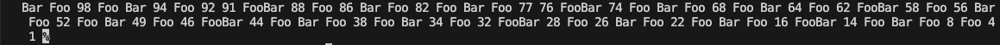
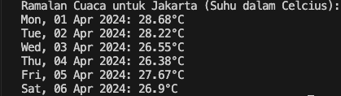

<h1 align="center">PT STAMPINDO LANCAR JAYA</h1>
<h2 align="center">Minitest</h2>

<h3>A. Program Kecil</h3>

Implementasi dalam mencetak satu array / list dari 1 sampai 100 dalam urutan terbalik, dengan menerapkan beberapa peraturan : 
    <ol>
        <li>Bilangan prima tidak dicetak</li>
        <li>Angka yang dapat dibagi dengan angka 3 dengan text "Foo"</li>
        <li>Angka yang dapat dibagi dengan angka 5 dengan text "Bar".</li>
        <li>Angka yang dapat dibagi dengan angka 3 dan 5 dengan text "FooBar".</li>
        <li>Array dicetak secara vertikal</li>
    </ol>

<h4>Source Code</h4>
<h4>Hasil</h4>

<h3>B. Cuaca Jakarta dalam 5 Hari</h3>
Implementasi dalam menampilkan ramalan cuaca 1 suhu per hari dalam satuan celcius pada kota Jakarta untuk 5 hari kedepan menggunakan API http://openweathermap.org
<h4>Source Code </h4>
<h4>Hasil</h4>
