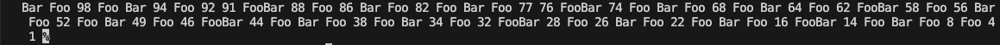
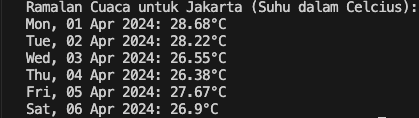
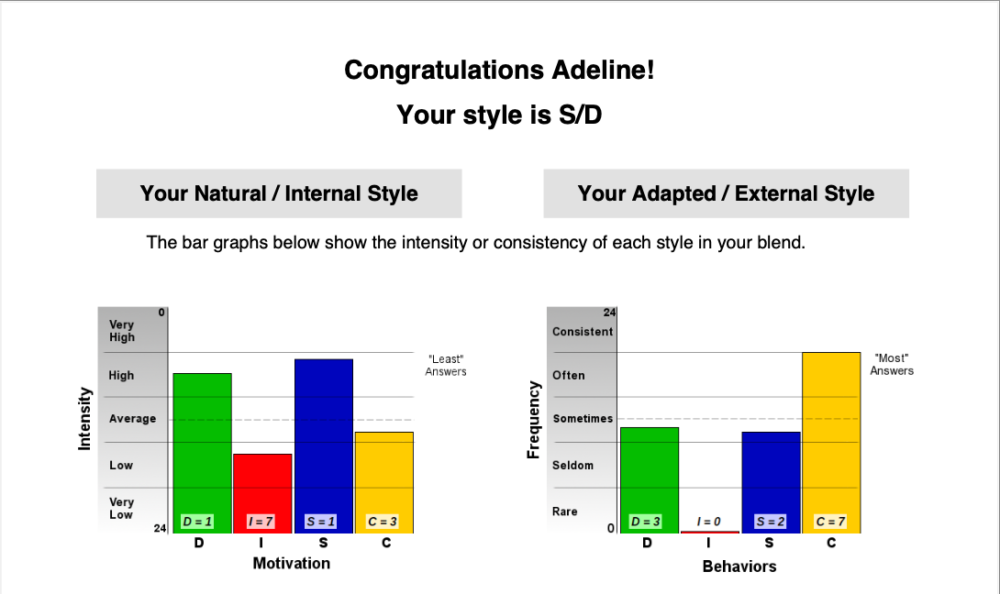

<h1 align="center">PT STAMPINDO LANCAR JAYA</h1>
<h2 align="center">Minitest</h2>

<h3>A. Program Kecil</h3>

Implementasi dalam mencetak satu array / list dari 1 sampai 100 dalam urutan terbalik, dengan menerapkan beberapa peraturan : 
    <ol>
        <li>Bilangan prima tidak dicetak</li>
        <li>Angka yang dapat dibagi dengan angka 3 dengan text "Foo"</li>
        <li>Angka yang dapat dibagi dengan angka 5 dengan text "Bar".</li>
        <li>Angka yang dapat dibagi dengan angka 3 dan 5 dengan text "FooBar".</li>
        <li>Array dicetak secara vertikal</li>
    </ol>

<h4><a href="https://github.com/adelineafgr/minitest-stamps/blob/main/procil.py" target="_blank">Source Code</a></h4>
<h4>Hasil</h4>

<h3>B. Cuaca Jakarta dalam 5 Hari</h3>
Implementasi dalam menampilkan ramalan cuaca 1 suhu per hari dalam satuan celcius pada kota Jakarta untuk 5 hari kedepan menggunakan API http://openweathermap.org
<h4><a href="https://github.com/adelineafgr/minitest-stamps/blob/main/cuaca.py" target="_blank">Source Code</a></h4>
<h4>Hasil</h4>

<h3>✅ C. Pertanyaan Awal</h3>

<h3>✅ D. Pernyataan Kesehatan</h3>

<h3>✅ E. DISC Test</h3>

  
<h3>Hubungi Saya</h3>

<svg xmlns="http://www.w3.org/2000/svg" viewBox="0 0 512 512"><!--!Font Awesome Free 6.5.1 by @fontawesome - https://fontawesome.com License - https://fontawesome.com/license/free Copyright 2024 Fonticons, Inc.--><path d="M48 64C21.5 64 0 85.5 0 112c0 15.1 7.1 29.3 19.2 38.4L236.8 313.6c11.4 8.5 27 8.5 38.4 0L492.8 150.4c12.1-9.1 19.2-23.3 19.2-38.4c0-26.5-21.5-48-48-48H48zM0 176V384c0 35.3 28.7 64 64 64H448c35.3 0 64-28.7 64-64V176L294.4 339.2c-22.8 17.1-54 17.1-76.8 0L0 176z"/></svg> adelineafigar@gmail.com